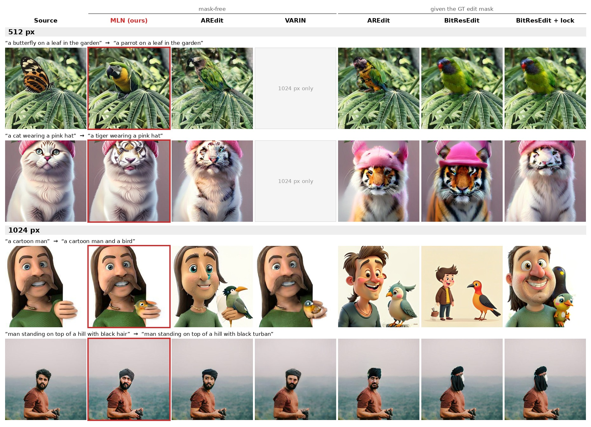

# Official implementation of 'Prompt-Guided Image Editing with Masked Logit Nudging in Visual Autoregressive Models'
## Overview oftraining-free text-guided image editing on visual autoregressive models

<p align="center"></p>

*PIE-Bench edits at 512 px and 1024 px of recent VAR apprpaoches. **MLN (ours)**, 
**AREdit** and **VARIN**  find the edit region itself and keep the rest of the image. The
mask-based methods **BitResEdit** or **AREdit** (given the ground-truth edit mask) often redraw much more than
the edited object. **VARIN's** HART model generates only at 1024 px.*

Four training-free editing methods on three next-scale-prediction backbones, at
512 px and 1024 px, behind one interface:

| Method | Backbone | Edit mask | Code |
|---|---|---|---|
| **MLN (ours)** — Masked Logit Nudging | Switti | found automatically | `methods/mln.py` |
| **AREdit** (re-implementation of Wang et al., 2025) | Infinity-2B | found automatically, or given | `methods/aredit.py` |
| **VARIN** (re-implementation of Dao et al., 2025) | HART-0.7B (1024 px only) | none needed | `methods/varin.py` |
| **BitResEdit** | Infinity-2B | must be given | `methods/bitresedit.py` |

## Results on PIE-Bench (700 images)

Standard PIE-Bench metrics, computed at 512 px (1024-px outputs are downsampled).
Background preservation (PSNR, LPIPS, MSE, SSIM) is measured outside the GT edit
mask. CLIP-Whole / CLIP-Edited measure how well the whole image / the edited region
match the target prompt. Mask-based methods are given PIE-Bench's ground-truth
edit mask and mask-free methods find the edit region themselves.

### 512 px

| Method | Backbone | Structure ↓ | PSNR ↑ | LPIPS ×10³ ↓ | MSE ×10⁴ ↓ | SSIM ×10² ↑ | CLIP-Whole ↑ | CLIP-Edited ↑ |
|---|---|---|---|---|---|---|---|---|
| ***Mask-free (the method finds the edit region itself)*** | | | | | | | | |
| AREdit re-impl., adaptive mask (mask-free) | Infinity-2B | 0.0261 | 23.46 | 80.11 | 80.34 | 80.33 | **25.57** | **22.14** |
| MLN (ours) | Switti | **0.0125** | **27.52** | **41.07** | **32.77** | **86.01** | 24.96 | 21.55 |
| ***Mask-based*** | | | | | | | | |
| AREdit re-impl., GT edit mask | Infinity-2B | 0.0379 | **26.00** | **41.64** | **36.80** | **85.76** | 25.44 | 22.58 |
| BitResEdit (GT mask) | Infinity-2B | 0.0578 | 24.26 | 52.42 | 53.75 | 84.76 | **26.97** | **24.00** |
| BitResEdit + structure lock (GT mask) | Infinity-2B | **0.0360** | 25.04 | 47.50 | 46.34 | 85.16 | 26.23 | 23.20 |

### 1024 px

PIE-Bench images (512 px) are upsampled bicubically to 1024 px before editing.

| Method | Backbone | Structure ↓ | PSNR ↑ | LPIPS ×10³ ↓ | MSE ×10⁴ ↓ | SSIM ×10² ↑ | CLIP-Whole ↑ | CLIP-Edited ↑ |
|---|---|---|---|---|---|---|---|---|
| ***Mask-free*** | | | | | | | | |
| AREdit re-impl., adaptive mask (mask-free) | Infinity-2B | 0.0243 | 24.45 | 76.00 | 70.32 | 83.52 | **25.51** | **22.30** |
| VARIN (s=6, τ=18, paper default) | HART-0.7B | 0.0122 | 25.62 | 57.87 | 48.57 | 80.14 | 24.25 | 20.75 |
| VARIN (s=6, τ=9) | HART-0.7B | 0.0200 | 23.26 | 80.85 | 79.11 | 75.63 | 24.87 | 21.34 |
| MLN (ours) | Switti | **0.0081** | **28.48** | **35.37** | **23.39** | **89.61** | 25.03 | 21.48 |
| ***Mask-based (given PIE-Bench's GT edit mask)*** | | | | | | | | |
| AREdit re-impl., GT edit mask | Infinity-2B | 0.0367 | **29.55** | **28.34** | **16.36** | **93.48** | 25.38 | 22.49 |
| BitResEdit (GT mask) | Infinity-2B | 0.0554 | 28.53 | 33.06 | 21.34 | 92.98 | **27.00** | **24.30** |
| BitResEdit + structure lock (GT mask) | Infinity-2B | **0.0345** | 29.37 | 29.84 | 18.17 | 93.35 | 26.42 | 23.62 |

## Usage

One script to create a conda env `mln` (Python 3.12, PyTorch 2.5.1 / CUDA 12.1),
the Python dependencies, and all weights (~62 GB):

```bash
bash setup.sh                 # env + dependencies + weights
bash setup.sh --no-env        # install into the current Python instead of a new conda env
bash setup.sh --weights-only  # only (re)download missing weights;  --no-hart skips VARIN's HART
conda activate mln
```

It downloads Infinity-2B, its VAE and flan-t5-xl into `weights/`, HART-0.7B and its
Qwen2-VL text encoder into `weights/hart/`, and Switti (512/1024), its VQ-VAE and the CLIP
text encoders into the Hugging Face cache. Existing files are kept. Other locations:
`INFINITY_WEIGHTS`, `HART_WEIGHTS`, `HF_HOME`. VARIN's HART builds a small CUDA kernel on
first use (needs `nvcc`; `setup.sh` installs it into the conda env if missing).

```bash
# command line (mask-free methods: mln, aredit, varin, varin_tau9)
python edit.py --method mln --reso 512 --input cat.jpg \
    --source "a cat sitting on a table" --target "a dog sitting on a table" --out dog.png
# mask methods (aredit_mask, bitresedit, bitresedit_lock) need --mask, white = edit
python edit.py --method bitresedit --reso 1024 --input cat.jpg --mask mask.png \
    --source "a cat sitting on a table" --target "a dog sitting on a table"

# demo: pick backbone, method and resolution; paint the mask for mask methods
python app.py            # http://localhost:7860  (--share for a public link)
```

```python
from methods import load_method
editor = load_method("mln", 512)
out = editor.edit(image, "a cat sitting on a table", "a dog sitting on a table")
# image: [1,3,R,R] in [-1,1] at R = 512 or 1024; out: [1,3,R,R] in [0,1]
```

## Layout

```
edit.py                      command-line editing
app.py                       gradio demo
methods/__init__.py          method registry: load_method(name, reso)
methods/mln.py               MLN (ours)
methods/aredit.py            AREdit
methods/varin.py             VARIN (+ HART loading)
methods/bitresedit.py        BitResEdit
methods/switti_backbone.py   Switti: loading, one scale step with logit nudging
methods/infinity_backbone.py Infinity-2B: loading, text/token/transformer helpers
switti/  infinity/  hart/     model code of the three backbones
setup.sh                     environment + weights
```

## Acknowledgements

Part of this implementation is based on the [**BitResEdit**](https://github.com/Shengqiang-Zhang/BitResEdit) repository (AREdit and BitResEdit). VARIN is
reimplemented from its paper.
## Citation

If you use this code, please cite our paper:

```bibtex
@article{elghoussani2026mln,
  title   = {Prompt-Guided Image Editing with Masked Logit Nudging in Visual Autoregressive Models},
  author  = {El-Ghoussani, Amir and H{\"o}lle, Marc and Carneiro, Gustavo and Belagiannis, Vasileios},
  journal = {arXiv preprint arXiv:2604.14591},
  year    = {2026}
}
```

and the methods compared here:

```bibtex
@article{wang2025training,
  title   = {Training-Free Text-Guided Image Editing with Visual Autoregressive Model},
  author  = {Wang, Yufei and Guo, Lanqing and Li, Zhihao and Huang, Jiaxing and Wang, Pichao and Wen, Bihan and Wang, Jian},
  journal = {arXiv preprint arXiv:2503.23897},
  year    = {2025}
}

@article{dao2025discrete,
  title   = {Discrete Noise Inversion for Next-scale Autoregressive Text-based Image Editing},
  author  = {Dao, Quan and He, Xiaoxiao and Han, Ligong and Nguyen, Ngan Hoai and Nobar, Amin Heyrani and Ahmed, Faez and Zhang, Han and Nguyen, Viet Anh and Metaxas, Dimitris},
  journal = {arXiv preprint arXiv:2509.01984},
  year    = {2025}
}

@article{zhang2026edit,
  title={Edit the Bits, Diff the Codes: Bitwise Residual Editing for Visual Autoregressive Models},
  author={Zhang, Shengqiang and Liao, Ruotong and Tresp, Volker and Plank, Barbara and Sch{\"u}tze, Hinrich},
  journal={arXiv preprint arXiv:2606.13558},
  year={2026}
}
```

The backbones and the benchmark:

```bibtex
@inproceedings{han2024infinity,
  title     = {Infinity: Scaling Bitwise Autoregressive Modeling for High-Resolution Image Synthesis},
  author    = {Han, Jian and Liu, Jinlai and Jiang, Yi and Yan, Bin and Zhang, Yuqi and Yuan, Zehuan and Peng, Bingyue and Liu, Xiaobing},
  booktitle = {Proceedings of the IEEE/CVF Conference on Computer Vision and Pattern Recognition (CVPR)},
  pages     = {15733--15744},
  year      = {2025}
}

@article{voronov2024switti,
  title   = {Switti: Designing Scale-Wise Transformers for Text-to-Image Synthesis},
  author  = {Voronov, Anton and Kuznedelev, Denis and Khoroshikh, Mikhail and Khrulkov, Valentin and Baranchuk, Dmitry},
  journal = {arXiv preprint arXiv:2412.01819},
  year    = {2024}
}

@inproceedings{tang2024hart,
  title     = {HART: Efficient Visual Generation with Hybrid Autoregressive Transformer},
  author    = {Tang, Haotian and Wu, Yecheng and Yang, Shang and Xie, Enze and Chen, Junsong and Chen, Junyu and Zhang, Zhuoyang and Cai, Han and Lu, Yao and Han, Song},
  booktitle = {International Conference on Learning Representations (ICLR)},
  year      = {2025}
}

@article{ju2023direct,
  title   = {Direct Inversion: Boosting Diffusion-based Editing with 3 Lines of Code},
  author  = {Ju, Xuan and Zeng, Ailing and Bian, Yuxuan and Liu, Shaoteng and Xu, Qiang},
  journal = {arXiv preprint arXiv:2310.01506},
  year    = {2023}
}
```
